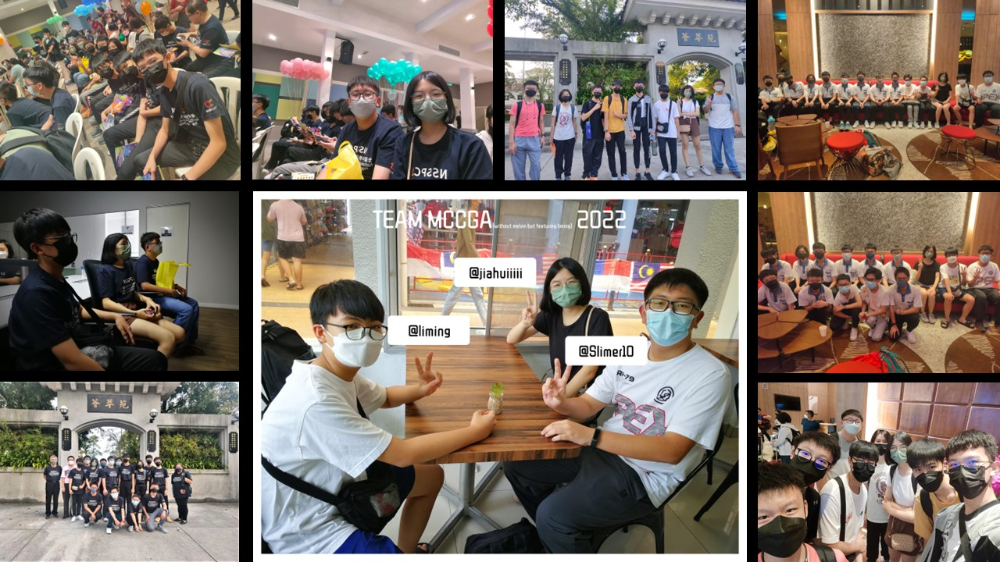

<h1 align="center">Hi there! Hope you have a nice day! 👋</h1>

I'm How Wei Shan, you can call me Slimer.

# ℹ Know more about me!

- Name: How Wei Shan
- Name (Chinese): 侯韦杉
- Web Name (which you can easily find me on web): Slimer10 / Slimer0210
- Where I live: Johor Bahru, Johore, Malaysia 🇲🇾
- Current occupation: Full-time student 👨‍🎓
- Hobby: Listening to Music🎶, Coding⌨
- Ambition: Front-end Developer🖥

## ⌨ When did I start Programming?

This is a long story... Back into 2020 when the largest worldwide pandemic - COVID-19 broke out. On 16th of March, 2020, the government of Malaysia announced a full lockdown (known as Movement Control Order) to control the spread of the coronavirus.

This is when my programming journey begins. When the lockdown period keeps extending, from 14 days to 90 days, I literally got mad as everyday I was just playing Minecraft besides studying in front of my screen.

One day, when I was watching some of the random videos from YouTube, I discovered my first programming language - Python (honestly mostly everyone starts from here). Python had been accompanied with me for a very long time until I wish to nove to frontend developing. Since the start of my programming journey, I prefer ignore my school online lessons as it is just a waste of time (honestly no one can be really concentrate in online class).

Soon in July, I got introduced about Github, where it is a very perfect place for me to store my code (instead of my 16gb pendrive). Since the born of Github on my brain, I started my first huge project - a music player. In the process of making the project, I grinded more libraries, more knowledge and many more than just a project. Also, making projects really made me fun - as I'm doing a thing that no one could do it for themselves.

At that year, instead of a prison year, it's the most for me. I never wasted anything along the lockdown period, and thanks for the lockdown, I have my life target.

### 🕑 2021 - Years for public exam

This year, I have some of my free time for coding. So in this year, instead of doing projects, I decided to explore more on a variety types of programming jobs. Since I have to sit for my public exam, I have to be more concentrate on study, and I got forced to shrink my coding time.

### 🕑 2022 - The year that defined my target

As explore continues, I found my final target - Front-end developer. And start from this year, I will be more concentrate on front end stuff. At the same time, I started my first (full) project - ManaMetal (check for ManaWeb, ManaDocs on my repo). 

At the same time, I very regret that I joined Science stream. Seriously science is a nightmare for me, it totally juiced all my programming time.
software programming.
### 🏆 Competitive Programming - NSSPC 2022

Actually in first I don't know too much about competitive programming, but after this nationwide competition I made a very new commiitee and also new friends and new experiences. I'm really enjoing myself along the journey. And also this competition opened a very new route for me - the competitive programming route. But I still wish to give my priority for 

*To be continued...*

# 📊 My Contribs In a Glance

# My coding story

Start from 2020, I involved myself in the world of programming to kill my time especially on lockdown period. After several months of programming, I found myself interesting in front-end developing.

In 2022, I was luckily to be introduced to the competitive programming. Because of this, I got a larger programming community and have a precious chance to represent school.

[Read the Full Story Here!](https://example.com/)

# My 2023 Target

I don't have any ideas yet. Maybe give me some?

# Misc

## How to reach with me? ✉

- Discord: Slimer0210#6409
- Facebook/Messenger/Instagram: howweishan0210
- Email: howweishan@gmail.com (for general enquires & work)
- Email: howweishan0210@outlook.com (for collabs, job offers)

